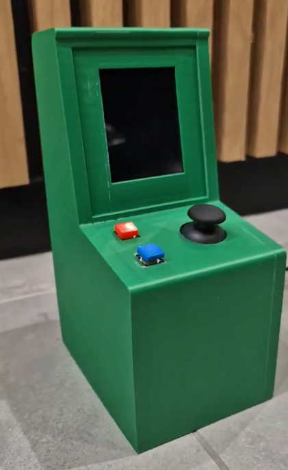

# Mini-Arcade-Machine
Project made for Embedded Systems laboratories at Poznań University of Technology.

## General Information
This project is a miniature gaming machine inspired by arcade machines from the 1980s. It supports three types of logic games:
* Minesweeper, 
* Memory,
* Simon Says.  

The machine utilizes a Raspberry Pi 4B along with a PiTFT touchscreen. Case model was designed using FreeCAD and 3D-printed. It is controlled via a joystick and buttons. Additionally, a built-in buzzer produces sounds and plays melodies.  

For more information check out our (polish) [documentation](doc/project_report.pdf).

## Setup guide 

To setup the PiTFT display, refer to the official PiTFT [documentation](https://cdn-learn.adafruit.com/downloads/pdf/adafruit-pitft-28-inch-resistive-touchscreen-display-raspberry-pi.pdf).  
After that install pygame along with sdl library using the following command:

* *sudo apt install python3-pygame libsdl2-dev*

After successful installation run the program using:

* *sudo python main.py*

## Project presentation
To see our arcade machine in action look at the project showcase [video](doc/project_showcase.mp4).  

